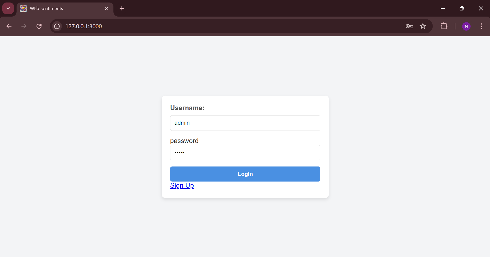
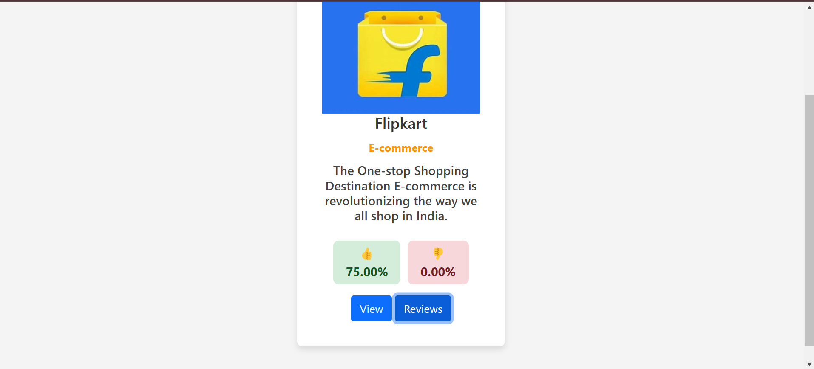
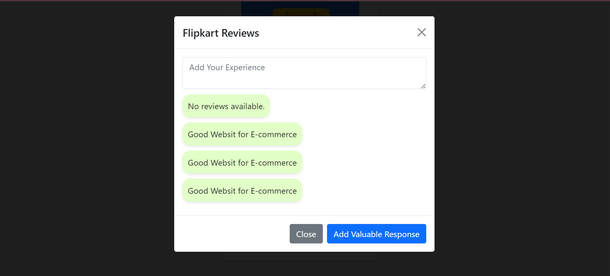

Web Sentiments

A platform for website owners and users to share and analyze user feedback.

Images:

Overview:

Web Sentiments is a web application that allows users to:

Sign up and create an account. 
Add their websites to the platform. 
Receive user reviews on their websites. 
Analyze user sentiment based on the reviews. 

Key Features:

User Authentication: Secure user registration and login. 
Website Management: Users can easily add and manage their websites. 
User Reviews: Users can submit reviews for websites, including text feedback and ratings. 
Sentiment Analysis: The platform analyzes user reviews to determine the overall sentiment (positive, negative, neutral). 
Data Visualization: Visual representations of sentiment trends and key insights. 
User-friendly Interface: Intuitive and easy-to-use interface for both website owners and reviewers. 

Technology Stack:

Backend: Node.js, Express.js 
Database: MongoDB 
Frontend: EJS, HTML, CSS, JavaScript 
